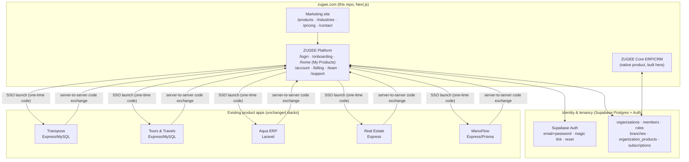
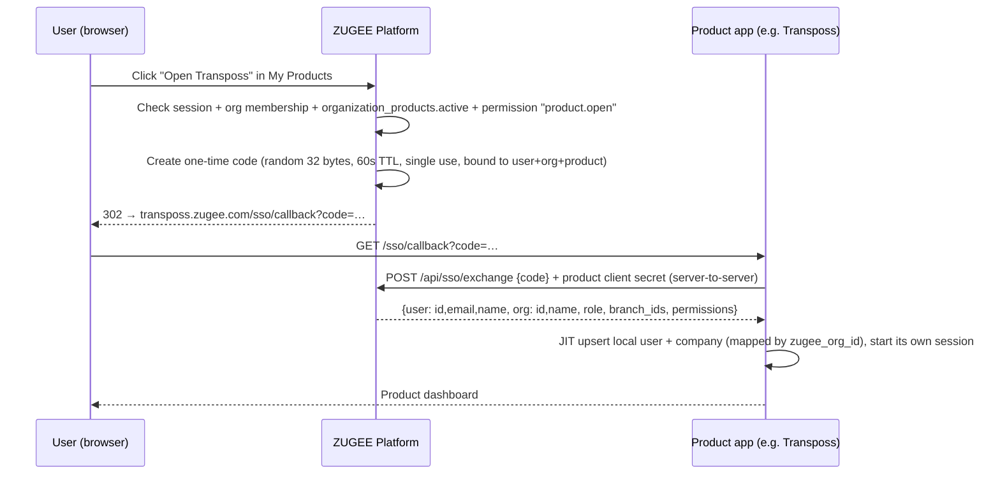

# ZUGEE Platform Restructuring — Architecture Audit & Implementation Plan

**Date:** 2026-09-25 · **Status:** Draft for founder review · **Scope:** this repo (`zugee`) plus the product codebases found under `E:\wamp64\www`

This plan follows the "Product Suite Restructuring" brief. Nothing here has been implemented yet. Every status below is based on evidence found in code, not on the brief's labels. Where the two disagree, the disagreement is called out.

> **The brief supersedes `ZUGEE-PROJECT-DOCUMENTATION.md`** on positioning (multi-product platform, not one GST billing product), the product list, and design direction (light and business-like, not neon terminal). That doc gets rewritten in Phase 0.

---

## A. Current Architecture

### A1. This repo (`zugee`)

| Layer | What exists | State |
|---|---|---|
| **Frontend** | Next.js 16.3 (App Router, Turbopack), React 19, Tailwind 4, framer-motion | Works |
| **Marketing** | `app/(marketing)`: 6-section homepage selling *GST billing + inventory*, lead form, JSON-LD, sitemap/robots | Renders well. **Sells features that don't exist** |
| **Admin portal** | `app/admin`: password + HMAC cookie, lead queue | Works; solid |
| **Product app** | `app/app/*`: dashboard, CRM, ads, GST, reports, back-office (billing/ERP/HR) | **Nobody can log in.** Mostly empty screens and fake numbers (see B) |
| **Backend** | Next route handlers: 2 public, 2 admin, 13 `/api/app/*` | Public/admin OK. `/api/app/*` broken or insecure |
| **Database** | Supabase Postgres. `schema.sql` (leads, newsletter) + `app-schema.sql` (11 tables, 3 views) | `app-schema.sql` **fails on a fresh DB**; code and schema disagree in 6+ places |
| **Auth** | Customer: Supabase JS client used incorrectly (no cookies, no SSR). Admin: own HMAC session | Customer auth **never succeeds** |
| **Tenancy** | `customer_id = auth.uid()`: one user = one business | Can't support teams, branches or roles |
| **Tests** | None | — |
| **Build** | `next build` **fails without Supabase env vars** (clients created at import time) | Blocks deploys |

### A2. The ZUGEE product codebases (found under `E:\wamp64\www`)

| Brief's product | Folder found | Stack | Evidence of maturity |
|---|---|---|---|
| Transposs (Fleet) | `transposaas` | React 18 + Vite · Express 5 · MySQL/Sequelize · JWT | **Most mature.** Tenancy (`Company`, `company_id`), RBAC, helmet, rate limiting, CORS allowlist, 18 migrations, 6 test files, Razorpay, working Meta/Google lead ingestion, driver app API |
| (Transposs variant?) | `ridexo` | Same as Transposs | Looks like a fork. **Needs clarifying** |
| Tours & Travels CRM | `tours-travels` | React + Vite · Express · MySQL/Sequelize | Code present, not yet reviewed |
| Aqua ERP | `aqua/aqua-backend-live`, `aqua/aqua-flow` | Laravel · React + Vite | Last commit 2026-09-15 |
| Real Estate ERP | `realestate` | React + Vite · Express · Sequelize (mysql2 + pg) | Last commit 2026-06-23 |
| Manufacture ERP (ManuFlow) | `Manuflow` | React + Vite · Express · Prisma | Code present |
| ZUGEE Core ERP? | `omnicore-git` | React + Vite · Laravel 11 + Sanctum | "Business OS scaffold"; already has **SSO login** from the Distribution CRM |
| School ERP | `schoolmgmt` | — | **Empty** (only `test.txt` in backend and frontend) |
| College Management | — | — | **Not found** |
| PG Management | — | — | **Not found** |
| Resort Management | — | — | **Not found** |
| Logistics Management | — | — | **Not found.** The brief also lists it both as "existing" (#6) *and* as Phase 3 "future" |

**What this means:** there are **four backend stacks**: Next.js/Supabase, Express/Sequelize, Express/Prisma and Laravel. That's the "11 codebases" problem from the September handoffs, now confirmed. The only realistic way to get to "one ZUGEE account" soon is a **platform that sits in front of the existing apps** (A below), not a rewrite into one codebase.

---

## B. Problems Found

The full evidence (file:line) is in the review from 2026-09-25. The launch-relevant items:

### Critical

| # | Problem | Where |
|---|---|---|
| C1 | Customer auth never works: the session check ignores cookies, and sign-in sets no cookie | `lib/app-auth.js:59-127`, `api/app/auth/signin` |
| C2 | Login page lives inside the protected layout, so it redirects to itself; `/app` layout renders a second `<html>` | `app/app/layout.jsx:30-44` |
| C3 | `/api/app/reports` has no auth, uses the service-role key, and takes `customer_id` from the client: cross-tenant data dump | `app/api/app/reports/route.js` |
| C4 | Dashboard SQL views bypass RLS, so every tenant's revenue and GST are readable | `supabase/app-schema.sql:617-655` |
| C5 | OAuth `state` = raw customer UUID: an attacker can link a victim's ad account to themselves, or the reverse | `api/app/crm/ad-accounts:90,106`, `oauth/*` |
| C6 | Customers can edit their own `plan_tier`, `subscription_status` and `trial_ends_at` | `app-schema.sql:64-66` |
| C7 | Signup never creates a profile (no insert policy), so every new user is locked out | `lib/app-auth.js:171` |
| C8 | Schema script fails on a fresh DB: foreign key to `ad_campaigns` before that table exists | `app-schema.sql:87` |
| C9 | **Fabricated numbers shown as real:** ITC = tax × 0.6; dashboard trends +12%/+8%/+5%/-3%; fixed funnel; "7x more likely"; `customer-uuid-here` | `api/app/gst:107`, `api/app/dashboard:96-101`, `dashboard/page.jsx:65-71`, `lib/ai-insights-engine.js`, `reports/page.jsx:17` |
| C10 | Marketing sells GST invoicing, e-invoice, stock alerts, WhatsApp reminders, Tally XML and GSTR-1. **None exist** | `lib/verticals.js:436-511` |
| C11 | **A live-looking SSO signing secret is committed to git** (pushed to `github.com/hariesh-etm/omnicore-git`) | `omnicore-git/SSO-CONNECT.md` §2 |

### High

- `next build` fails without secrets (import-time `createClient` / `throw` in 6 modules).
- No security headers (clickjacking on the admin login).
- No rate limiting on signup, sign-in, magic-link or reset. Error messages reveal whether an email is registered.
- CRM PATCH writes any field; a stale form can overwrite the previous lead.
- OAuth callbacks write a column that doesn't exist, then report "success".
- AI insights engine references columns that don't exist and inserts duplicates every run.
- GST slab set out of date (0/5/12/18/28 hardcoded, and bills are snapped to the nearest slab).
- Magic-link callback reads `searchParams` synchronously (it's a Promise in Next 16). The reset-password page doesn't exist.
- Lead form rejects Gmail users as "non-corporate", and email is required while phone is optional.
- No phone, WhatsApp, address, founder name, privacy policy or terms anywhere.

### Medium

- 236 KB compressed JS on a static homepage (framer-motion everywhere; footer and contact section are fully client-side).
- 643 KB share image with the retired logo; roughly 1.5 MB of unused assets.
- UTC "today" for IST businesses.
- Alphabetical severity sort.
- Race condition on CRM search.
- Missing composite indexes.
- Sidebar is unusable on phones; top bar is decorative (fake "System Live", always-on notification dot).
- Admin rate limiter is in-memory only.

### Low

Dead code, CSS and assets; unused imports; `alert()`/`confirm()` for errors; copy-pasted currency formatting; `lang="en"` instead of `en-IN`.

### What works and must be kept

- Marketing page structure and SEO plumbing (JSON-LD generated from the same data as the page).
- Lead API (validation, honeypot, rate limit).
- Admin portal session design.
- OAuth token encryption (AES-GCM).
- Schema constraints.
- The app UI kit (KPICard, EmptyState, focus states).
- **All of Transposs.**

---

## C. Target Architecture

### C1. The shape: ZUGEE Platform in front of ZUGEE Products



**Principles**

1. **One ZUGEE account** (Supabase Auth). Product apps **stop issuing their own logins** for ZUGEE customers. They accept a ZUGEE SSO launch and create their local user and tenant just in time (JIT). OmniCore already does exactly this for the Distribution CRM, so the pattern is proven in-house.
2. **The platform owns:** identity, organizations, members, roles, branches, which products an org has, subscriptions, the marketplace, and notifications (later).
3. **Each product app owns its business data**, in its own database, keyed by its existing tenant id (`company_id` in Transposs), mapped 1:1 to the ZUGEE `organization_id`.
4. **ZUGEE Core ERP/CRM is built natively in this repo** on the same Postgres, so it shares the org and role tables directly. It is the first product built "the new way" and the template for future ones.
5. **No product is ported between stacks until it has paying customers.** That's the brief's "don't rewrite unnecessarily", and the September handoff's "Path B first, then A".

### C2. SSO launch flow (safer than the current OmniCore pattern)

The current OmniCore flow puts a long-lived HS256 JWT **in the URL** and uses one **shared secret** per app. The target flow:



- The code in the URL is useless on its own: it can only be redeemed once, for 60 seconds, by the product's backend with its client secret.
- Each product gets its **own client id and secret**, so a compromised app can't impersonate another.
- Roles and permissions are re-sent on every launch, so role changes in ZUGEE take effect at the next launch. Revoked members are refused at launch.
- Logout: the platform logs out itself and calls each product's back-channel logout endpoint (Phase 8).

### C3. Tenancy and RBAC

```text
auth.users ─┬─ profiles (name, phone)
            └─ organization_members (org, user, role, status) ── member_branches
organizations ─┬─ branches
               ├─ roles (system: owner, admin, manager, staff, accountant, sales_executive, viewer; + custom later)
               │     └─ role_permissions ── permissions ("invoices.create", "members.manage", "billing.manage", …)
               ├─ organization_products (product, status, external_tenant_ref)
               └─ subscriptions (product, plan, status, period, trial_ends_at)   ← server/billing only
```

- **RLS everywhere**, based on membership and never on client input:
  - `is_org_member(org_id)` and `has_permission(org_id, perm)`: `security definer` SQL functions, `stable`, with a fixed `search_path`.
  - Every tenant table has `organization_id not null` and the policy `using (is_org_member(organization_id))`, plus per-action permission checks on insert, update and delete.
- **Server code never trusts** `organizationId`, `role`, `plan` or `userId` from the browser:
  - The active org comes from the URL (`/w/[orgSlug]/…`), and membership is checked on every request.
  - Role and permissions are loaded server-side.
- **Billing columns** (`plan_id`, `status`, `trial_ends_at`, `current_period_end`) have **no update grant** for `authenticated`. Only the service role changes them, through billing workflows.

### C4. Auth (Next.js 16 + Supabase)

- `@supabase/ssr` `createServerClient` with the `cookies()` adapter, created **per request** (never a module singleton).
- `proxy.js` (Next 16's rename of middleware) refreshes the session cookie and redirects unauthenticated users away from `/home`, `/w/*` and `/onboarding`.
- Auth pages live in a **public route group** (`app/(auth)/login`, `/signup`, `/reset-password`, `/auth/callback` as a route handler). The protected group has its own layout, and **only the root layout renders `<html>`**.
- Server-side checks use `auth.getUser()`, which validates with Supabase, not `getSession()`.
- Profile and org creation run through a Postgres trigger on `auth.users` insert (profile) plus an onboarding server action (org + owner membership in one transaction).
- Rate limits on sign-in, signup, reset, magic link and the lead form, backed by Postgres or Upstash (in-memory doesn't survive serverless).
- Generic auth error messages that don't reveal whether an email is registered. Magic link uses `shouldCreateUser: false`.

---

## D. Database Changes (Supabase / this repo)

Applied as **numbered migrations** (`supabase/migrations/0001_…sql`), replacing the single `app-schema.sql`. No production data exists yet, so destructive changes are safe **now** and won't be later.

### Create

| Table | Purpose / key columns |
|---|---|
| `profiles` | `user_id` PK→auth.users, `full_name`, `phone`, `locale`. Created by trigger |
| `organizations` | `id`, `name`, `slug` (unique), `legal_name`, `gstin` (nullable, validated when present), `state_code`, `industry`, `timezone` default `Asia/Kolkata`, `created_by` |
| `organization_members` | `org_id`, `user_id`, `role_id`, `status` (invited/active/suspended), unique (`org_id`, `user_id`) |
| `invitations` | `org_id`, `email`/`phone`, `role_id`, `token_hash`, `expires_at`, `accepted_at` |
| `branches` | `org_id`, `name`, `address`, `gstin` (per-branch GSTIN support), `is_default` |
| `member_branches` | `member_id`, `branch_id`: restricts staff to branches |
| `roles` | `id`, `org_id` (null = system role), `key`, `name`, `is_system` |
| `permissions` | `key` PK (e.g. `invoices.create`, `members.manage`, `billing.manage`, `settings.manage`, `reports.export`) |
| `role_permissions` | `role_id`, `permission_key` |
| `products` | Catalog: `slug`, `name`, `category` (business/industry), `industry`, `short_description`, `modules` jsonb, `status` (`live`/`beta`/`in_development`/`coming_soon`), `launch_url`, `sso_client_id`. **Status is set by the founder only after the checklist in F** |
| `sso_clients` | `product_slug`, `client_id`, `client_secret_hash`, `redirect_uris`, `active` |
| `sso_codes` | `code_hash`, `user_id`, `org_id`, `product_slug`, `expires_at`, `used_at` |
| `organization_products` | `org_id`, `product_slug`, `status` (active/suspended/cancelled), `external_tenant_ref`, `activated_at` |
| `subscription_plans` | `product_slug`, `key`, `name`, `price_inr`, `interval`, `max_users`, `max_branches`, `features` jsonb, `is_public` |
| `subscriptions` | `org_id`, `product_slug`, `plan_id`, `status`, `trial_ends_at`, `current_period_end`, `provider`, `provider_ref`. **No client update grant** |
| `rate_limits` | `key`, `window_start`, `count`: shared limiter for serverless |
| **Core ERP** (Phase 4) | `parties` (customers/vendors), `items` (goods/services, HSN/SAC, unit, tax_rate_id, track_stock), `tax_rates` (rate, cess, effective_from/to, configured per org, never hardcoded), `sales_invoices` + `sales_invoice_items`, `payments` + `payment_allocations`, `stock_movements` (ledger; stock = sum, never a mutable number), `purchases` + `purchase_items`, `tasks`, `document_sequences` (per org/branch/FY invoice numbering) |

### Modify

| Table | Change |
|---|---|
| `crm_leads` | `customer_id` → `organization_id`; add `branch_id`, `assigned_to` (member). Server-side whitelist of editable fields |
| `gst_configurations` | → `organization_id` (or merged into `organizations`/`branches`). GSTIN nullable for unregistered businesses |
| `employees` | → `organization_id`, `branch_id`, optional `member_id`. Fix the "encrypted" comment on salary, or actually encrypt it |
| `audit_log` | → `organization_id`, `actor_user_id`, `action`, `entity`, `entity_id`, `diff` jsonb. Insert-only via server |
| `leads` (marketing) | `phone` required; `email` optional; add `company_name`; `business_type` replaces the vertical allowlist with the product/industry list; drop the `fit-quiz`/`pricing-estimator` sources |

### Remove

| Table / object | Why |
|---|---|
| `customer_profiles` | Replaced by `profiles` + `organizations` + `subscriptions` |
| `invoices` (current) | Replaced by `sales_invoices` + `sales_invoice_items` (no line items, fake `gst_rate`) |
| `products` (current) | Replaced by `items` + `stock_movements` (the name also collides with the product catalog) |
| `ad_accounts`, `ad_campaigns` | Transposs already has working Meta/Google lead ingestion. Don't maintain a second, broken copy. Revisit as a platform-level integration later |
| `ai_insights` | Rebuilt in Phase 7 on real data |
| `generated_reports` | Schema never matched the code. Rebuild when Core reports exist |
| views `dashboard_today_metrics`, `dashboard_monthly_revenue`, `dashboard_monthly_ad_spend` | RLS bypass. Replace with `security_invoker` views or RPCs |
| `newsletter_subscribers` | Remove along with the footer newsletter (competes with the CTA; the promised briefing doesn't exist) |

### Rename

`customer_id` → `organization_id` everywhere; `products` (inventory) → `items`; `invoices` → `sales_invoices`.

### Indexes

Composite `(organization_id, created_at desc)` on every list table, plus `(organization_id, status)`, `(organization_id, invoice_date)`, `(organization_id, item_id)` on `stock_movements`, and unique `(organization_id, branch_id, fy, number)` on invoices.

---

## E. API Changes

### Retain

| Route | Notes |
|---|---|
| `POST /api/leads` | **Modify:** phone required, email optional, no "corporate email" wording, new business types |
| `/api/admin/auth`, `/api/admin/leads` | Keep for now. Later becomes the ZUGEE staff console, on platform auth with a `zugee_staff` flag |

### Remove

`/api/app/ads/campaigns`, `/api/app/crm/ad-accounts`, `/api/app/oauth/meta`, `/api/app/oauth/google`, `/api/app/insights/compute`, `/api/app/reports`, `/api/app/gst`, `/api/app/dashboard`, `/api/app/auth/*` (all five), `/api/subscribe`.

The auth routes are replaced by server actions and route handlers using `@supabase/ssr`. The rest are rebuilt on the new model when their feature is real.

### Create (platform)

| Route / action | Purpose |
|---|---|
| `app/(auth)/auth/callback/route.js` | Code exchange for email confirmation, magic link and reset |
| Server actions `signIn`, `signUp`, `signOut`, `requestReset`, `updatePassword` | Rate-limited, generic errors |
| `createOrganization` (onboarding) | Org + default branch + owner membership + first `organization_products` row, in one transaction |
| `GET /api/products` | Public catalog (marketplace + marketing) |
| `/api/w/[org]/members` (GET, POST invite, PATCH role, DELETE) | Needs `members.manage` |
| `/api/invitations/accept` | Token-hash lookup, expiry, single use |
| `/api/w/[org]/branches` | CRUD, needs `settings.manage` |
| `/api/w/[org]/products/[slug]/activate` | Creates `organization_products` + trial subscription (server-only fields) |
| `GET /sso/launch/[slug]` | Checks membership + product active + permission; issues one-time code; 302 to the product |
| `POST /api/sso/exchange` | Server-to-server; client id/secret; returns user/org/role/permissions |

### Create (Core ERP, Phase 4)

`/api/w/[org]/parties`, `/items`, `/sales-invoices` (create → numbered, taxed from configured `tax_rates`, PDF), `/payments`, `/stock-movements`, `/purchases`, `/tasks`, `/reports/{sales,outstanding,stock}`. Every handler follows the same order: `getUser()` → load membership → check permission → query with a **user-scoped client** (RLS as the second line of defence). The service role is only for cron, webhooks and SSO exchange.

### Product apps (per app, small)

Add `GET /sso/callback` + a JIT user/tenant upsert + a `zugee_org_id` column on its tenant table. Transposs: on `Company`. Existing local logins keep working for current customers during migration.

---

## F. Product Roadmap (evidence-based)

> **Update 2026-09-25 — founder sign-off:** the founder confirmed that every product in the brief's "existing / ready" list is ready and sold through a live demo meeting. On the website these are now **Available**: ZUGEE ERP/CRM, Transposs, Tours & Travels, Aqua, Real Estate, ManuFlow, School, College, PG, Resort. Logistics and all Phase 2/3 products stay **Coming Soon**. The evidence table below is kept as the engineering view: it tracks which codebases still need the security review and the SSO connection (Phase 5), which is separate from whether the product can be sold and demoed today.

A product is marked **Live** on the site only after it passes this checklist:
1. A real deployment URL is serving it.
2. At least one real business is using it, or the founder has signed off after a full end-to-end test.
3. SSO launch works.
4. Every module listed on its card works.

Until then, the status below is the **highest it can be**, not what it is.

| Status | Products | Basis |
|---|---|---|
| **Live** *(pending the checklist)* | **Transposs** | Mature codebase with tenancy, RBAC, tests and payments. Confirm the production URL and a customer |
| **Beta** *(pending review + checklist)* | Tours & Travels CRM, Aqua ERP, Real Estate ERP, ManuFlow | Code exists; not yet reviewed. Each needs the same review Transposs got |
| **In Development** | ZUGEE Core ERP/CRM (this repo), ZUGEE Platform itself | Being built in Phases 1–4 |
| **Coming Soon** | School ERP (folder empty), College Management, PG Management, Resort Management, Logistics Management, Gym, Salon, Medical CRM, Civil Construction, Task Management, Warehouse | No code found on this machine. **If these exist elsewhere, share the paths and they'll be re-graded** |
| **Clarify** | `ridexo` (Transposs fork?), OmniCore (is it Core ERP, or a separate product?) | — |

---

## G. Implementation Plan

Each phase ends with `npm run build` passing and its tests green. Sizes are relative (S/M/L/XL), not promises.

### Phase 0 — Truth & cleanup (S) · *no new features*

1. **Rotate the OmniCore SSO secret** and scrub it from git history if the repo is public.
2. **Marketing tells the truth:**
   - Remove unbuilt features from pricing and the FAQ, remove "backed up automatically", "Tally XML" and the unconfirmed user limits.
   - Rename the Proof section.
   - Remove the newsletter and the public admin link.
   - Delete the fake `mockup` blocks and made-up names in `lib/verticals.js`.
3. **Fake data out of `/app`:**
   - ITC ×0.6 → "Coming Soon".
   - Hardcoded trends and funnel removed.
   - `customer-uuid-here` removed.
   - "AI Insights" hidden.
   - Every button that does nothing is either disabled with a "Coming Soon" label or removed.
4. **Build passes without secrets:** lazy client creation in all 6 modules, no throw at import.
5. **Security headers** in `next.config.mjs` (frame-ancestors, nosniff, Referrer-Policy, Permissions-Policy, HSTS in production, CSP report-only first), plus `poweredByHeader: false`.
6. **Lead form:** name + mobile/WhatsApp + business type required; email, company and requirement optional.
7. **Delete dead code and assets** (roughly 1.5 MB, unused icons, CSS, prefill code). New share image under 200 KB.
8. **Rewrite `ZUGEE-PROJECT-DOCUMENTATION.md`** to the brief.

**Exit:** no false claim on any page; `npm run build` green with no env vars.

**Status (2026-09-25, branch `phase-0-truth`): done, except the items marked ☐.**
- ✅ Homepage rebuilt around the product catalog (`lib/products.js`), with honest statuses. GST-product sections, fake sample dashboard, empty Proof section, pricing tiers and trial claims removed.
- ✅ Lead form: name + mobile + business type required; email/company optional; no "corporate email"; phone-first confirmation. Schema and admin portal updated; migration SQL is in `supabase/schema.sql`.
- ✅ Newsletter, public admin link, fake "Core Online" dot and jargon tagline removed. framer-motion removed from the site.
- ✅ `/app`:
  - GST, Reports, Ads, Billing, Inventory and Employees now show Coming Soon.
  - Their fake calculations and the insecure routes are deleted: reports IDOR, OAuth `state`, insights compute, ITC ×0.6.
  - Dashboard shows only real `crm_leads` counts.
  - CRM PATCH whitelisted; stale-form bug fixed.
  - Top bar and sidebar decoys removed.
- ✅ `app-schema.sql` runs on a fresh DB; RLS-bypassing views dropped; billing columns no longer client-writable.
- ✅ `npm run build` passes with **no** env vars; `eslint .` clean.
- ✅ Security headers + `poweredByHeader: false`; robots excludes `/app`; fixed sitemap date.
- ✅ ~2.2 MB of unused assets, dead components and dead CSS removed; new 51 KB share image.
- ✅ `ZUGEE-PROJECT-DOCUMENTATION.md` rewritten (v2.0); README updated.
- ☐ **Rotate the OmniCore SSO secret** (founder: it's in another repo and on a live server).
- ✅ **Product statuses:** founder confirmed the ready products (see §F update); CTAs now lead to "Book a Demo".
- ☐ Trust details, `/privacy` and `/terms` (need real founder details; Phase 3). The signup form still says "you agree to our Terms of Service and Privacy Policy", and those pages don't exist yet.
- ☐ Phone-width check on a real device (headless Edge can't render below ~500 px).

### Phase 1 — Authentication (M)

- `@supabase/ssr`, `proxy.js`, `(auth)` route group, callback route handler, profile trigger.
- Sign-in, signup, logout, reset, magic link and email verification.
- Rate limits and generic errors.
- Remove the old `/api/app/auth/*` and the nested `<html>`.
- **Tests:** Vitest for the actions; Playwright for signup → verify → login → logout → reset.

### Phase 2 — Multi-tenancy & RBAC (L)

- Migrations from D (platform tables), the RLS helper functions, and seeded system roles and permissions.
- Onboarding: business info → industry → details → invite users → pick a plan (manual/trial only) → workspace created → product dashboard.
- Team and branch management screens.
- **Tests:** SQL tests that org A cannot read, write or update org B in every table, and that a viewer cannot create. API tests for unauthorised access (401/403).

### Phase 3 — Product marketplace & SSO (M)

- **Marketing:** `/products` with status badges from the `products` table, and `/products/[slug]` for Live/Beta products only (Coming Soon products are cards with no detail page).
- **Platform:** `/home` "My Products" and `/w/[org]/products`.
- SSO launch/exchange.
- **The first product connected: Transposs** (`/sso/callback` + JIT + `zugee_org_id`).
- New site navigation and the hero from the brief. Light, business-like design system.
- Trust page, `/privacy`, `/terms`, `/refund` **with real founder-supplied details**.

### Phase 4 — ZUGEE Core ERP/CRM (XL, split into shippable slices)

Each slice ships only when it fully works:
1. Customers (parties)
2. Items
3. Sales invoice with configured GST and a PDF
4. Payments and outstanding
5. Stock ledger and low-stock alerts
6. Purchases
7. Reports (sales, outstanding, stock)
8. Tasks

The dashboard shows only real queries: today's sales, pending payments, low stock, follow-ups. **GSTR-1, e-invoice and Tally export stay "Coming Soon"** until built and checked with a CA.

### Phase 5 — Industry products (L, per product)

For each of Tours & Travels, Aqua, Real Estate and ManuFlow:
1. Security and function review, like Transposs.
2. Add the SSO callback.
3. Map the tenant.
4. Pass the checklist from F.
5. Flip the status.

New verticals (School, PG, Resort, …) are built **as modules on Core ERP** where the data model fits, not as new codebases.

### Phase 6 — Billing & subscriptions (M)

**Started early (2026-09-25):**
- **Pricing:** Starter ₹1,999/mo + ₹4,999 one-time setup; Growth ₹4,099/mo + ₹9,999 setup. Defined in `lib/pricing.js` and shown on the site.
- **Database:** `supabase/migrations/0001_subscriptions_setup_fee.sql` creates `subscriptions` + `subscription_payments`. Prices are snapshotted, the setup fee can be recorded only once, and it can be waived only by an admin.
- **Admin:** `/admin/subscriptions` records payments the team has collected, waives setup, and changes status.
- **Customer:** `/app/back-office/billing` shows the subscription once login works (Phase 1).
- **Still to build here:** payment gateway checkout, invoices with separate setup and subscription line items, and moving subscriptions from `customer_id` to `organization_id` (Phase 2).

- Razorpay subscriptions (Transposs already has Razorpay code to learn from).
- Webhooks as the only writer of `subscriptions`.
- Plans per product × users × branches.
- Trials enforced server-side.
- Invoices for ZUGEE's own billing.
- No usage billing until the rules are defined.

### Phase 7 — AI (M)

- Summaries of **real** records only ("6 invoices overdue > 7 days"; "18 leads pending follow-up").
- No invented statistics.
- Every insight links to the records behind it.
- Built on the Claude API with tool access limited to the org's own data.

### Phase 8 — Production hardening (M)

- Enforced CSP.
- Back-channel SSO logout.
- Audit log UI.
- Backups: verify and document, **then** it can be claimed on the site.
- Error monitoring.
- Load test.
- DPDP data-handling notes for clinics and schools.
- A disaster recovery drill.

---

## Open decisions for the founder

1. **Integration model:** platform + SSO in front of existing apps (recommended), or merge everything into one codebase now?
2. **Is OmniCore the "ZUGEE Core ERP/CRM"?** If so, Core ERP could extend it (Laravel) instead of being built here. This plan assumes Core ERP is built here, on the platform's own Postgres.
3. **Where are School, College, PG, Resort and Logistics?** Not on this machine.
4. **What is `ridexo`?**
5. **Trust details:** founder/team names, registered address, phone, WhatsApp, support email, CIN/GSTIN (only real ones).
6. **Pricing per product.** The ₹1,999/₹4,099 tiers were designed for the GST billing product.
